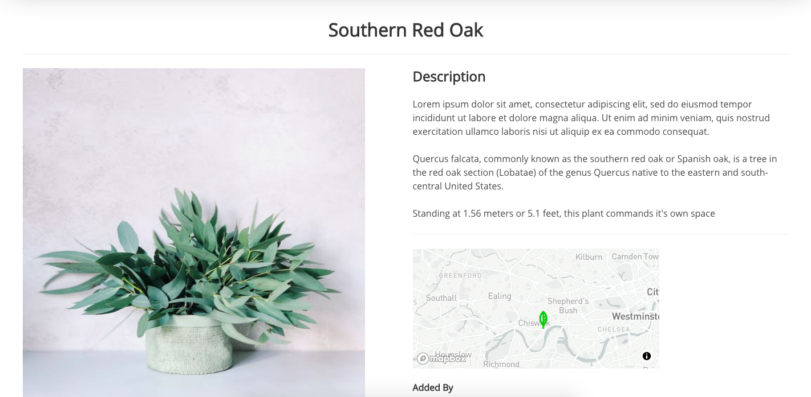

# SEI Group Project: Plantify
## https://plantify-project.herokuapp.com/
## **Overview.**
It is a social app for houseplant-lovers focused on presenting and trading their plants.
Users can have photos of their plants displayed on their profile page. Other users can give the offer to trade plants, like, comment on each plant, and they are able to have a private chat.
App has a feature to find plants that are in the user's area via interactive maps. The location of the plant on the map is also shown on a single plant page.
 
***Timeframe*** for the project was one week.
 
## My Team:
* [Yarden Lawson](https://github.com/YBL123)
* [Aino Kytölä](https://github.com/ainokyto)
* [George Jones](https://github.com/Jompra)

-------------------------
## Brief
* **Build a full-stack application** by making your own backend and your own front-end.
* **Use an Express API** to serve your data from a Mongo database.
* **Consume your API with a separate front-end** built with React.
* **Be a complete product** which most likely means multiple relationships and CRUD functionality for at least a couple of models.
* **Implement thoughtful user stories/wireframes** that are significant enough to help you know which features are core MVP and which you can cut.
* **Have a visually impressive design** to kick your portfolio up a notch and have something to wow future clients & employers. **ALLOW** time for this.
* **Be deployed online** so it's publicly accessible.

## Get Started
Clone or download the repo.
 
Run those commands in terminal:
* **npm i**
* **mongod --dbpath ~/data/db** if you are using MacOS Catalina. Otherwise run **mongod**
* **npm run seed** for seeding
* **npm run start** for both, back-end and front-end

## **Technologies used.**

#### Front End:
* React
* Axios
* Bulma
* SaSS
* React loader spinner
* React router dom
* Cloudinary
#### Back End:
* Express
* Node.js
* MongoDB
* Mongoose
#### Dev Tools:
* Yarn
* VScode
* Insomnia
* Git
* Github
* Chrome Developer Tools
* Heroku

### APIs:
* [Mapbox](https://www.mapbox.com/)
* [Image Moderation](https://www.moderatecontent.com/)
* [Pexels](https://www.pexels.com/api/?locale=en-US)
* [Trefle.io](https://trefle.io/)
* [Wikipedia](https://www.mediawiki.org/wiki/API:Main_page)

## How to use the App
### Login and  Register
Sign up for a new account on the home page.

### Index Page
After you sign up for an account, you will be automatically logged in and redirected to the index page. Here you can see plants from all of the users.

### Single Plant Page
When you click on one of the plants, you will be redirected to the single plant page. Here you can see the name, description, and location of the plant owner.
You can like or comment on the plant, and also you can give an offer to the plant owner.
 

 
### Trading functionality
 
1. When you like some plant, you can send an offer to the plant owner. You must include some of your plants to trade and optionally you can send a message with an offer.
 

2. The user who got the offer can see it on their profile and can accept or decline it the offer.
 

3. Then user who gave the offer can see on their profile if the offer was accepted or decline if users met, and successfully finished trade, then the user just needs to click the button that trade was finished and it will delete photos of the plants from a portfolio of both users, and they can add new photos of their new plant.
 

### Profile Page
The profile page contains offers on user plants and responses on their offers on the top and user portfolio on the bottom of the page.
 

### Maps
 
If you click on the map on the index page, you will be redirected to the map page where you can see all the plants in your area.
Phrase "Hot plants in your area" is a joke referring to the lame online ads.
 

## Development
 
### Timeline
* Day 1 - Planning
* Day 2 - 4 MVP was finished
* Day 5 - 6 Extra features was finished, and also existing features were polished
* Day 7 - Styling
 
### Planning
* On the first day of our project week, we've been planning what and have we gonna do.
We made a wireframe and wrote down the plan of the development process in Balsamiq. So we set our deadlines and wrote down key features which our app must have, and optional features which we gonna do if we have some time left, which Schemas we gonna need, etc.

* This was our project plan in Balsamiq.

 
* On the second day we start to work on a code. We decided not to split up on Front End, and Back End, but each of us had responsibility for different functionalities and some of the functionalities we've been doing in a pairs.
My main responsibility was a plant-trading feature and private chat. I was also doing some other smaller tasks and part of the design.
### Plant trading functionality
* For creating models I used Mongoose schema. The offer schema is saved in the Plant schema as an array.

* Each plant database contains all the offers on the specific plant. User schema contains virtual schema "createdPlants", so those offers can be accessed from the user database too.
 

* Submitted offers have their own Mongoose schema, and they're saved like an array in user schema.

* When a user makes an offer, in requested URL, will be sent plant id, and also the id of the plant which customer wants to trade for. Also, the id of the user who's giving the offer is sent in the request. There is a security check if the plant in which receiving the offer really exists, if not then it will throw a new error, if everything is ok, then it will save the plant with a new offer in its database.

* When trade is successfully finished, users can see on their profile button which says "Trade was successfully finished".
It will send a new request, and this request will contain the id of both plants included in the trade, and both of the plants models will be removed. After that, both users model participated in the trade will be saved.

 
## Wins
* Experience of working in a group. Planning projects together, dividing tasks, group debugging, and problem-solving was a very valuable experience. We were very effective and had no arguments during the whole time of development.
* Much better understanding of MongoDB and Express.js.
* Understanding of external APIS documentation.
* Making first wireframes, and working with Balsamiq.
 
## Challenge
* Working with a GitHub as a group was the biggest challenge on the project. We needed to communicate every time before we merged something, also when someone starts to work on some new functionality or some bits of codes, we were always communicating before it happens, just to making sure that two members don't work on the same thing, or that those functionalities don't interfere to each other. When we had some merged conflict in GitHub, the whole group was trying to do it together to make sure, that we don't delete something important. It was the first time experience for all of us, but thanks to good communication, everything went smoothly and we learned a lot about using GitHub.
* Dividing tasks, and making sure we work in the same direction, and all functionalities coexist well together.

## Key Learnings
* Working in a group
* Using GitHub as a group
* Understanding of MongoDB, and Express.js
* Feeling confident with React

## Bugs
Private chat between users doesn't work properly now. When the user opens the chat page, he can see buttons with the username of the users who he have chats with. When the user clicks on that button, it should show only chat with that particular user, but right now it opens chats with all of the users who have current user chat with. 

